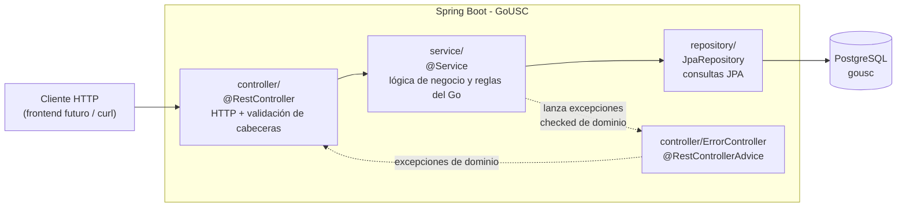
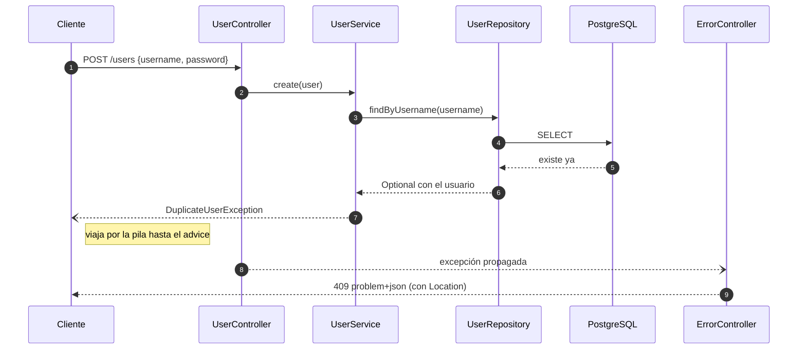
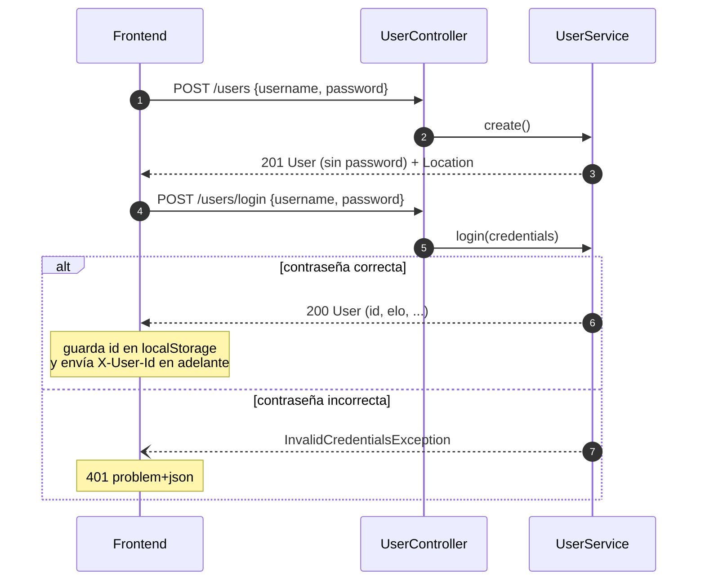
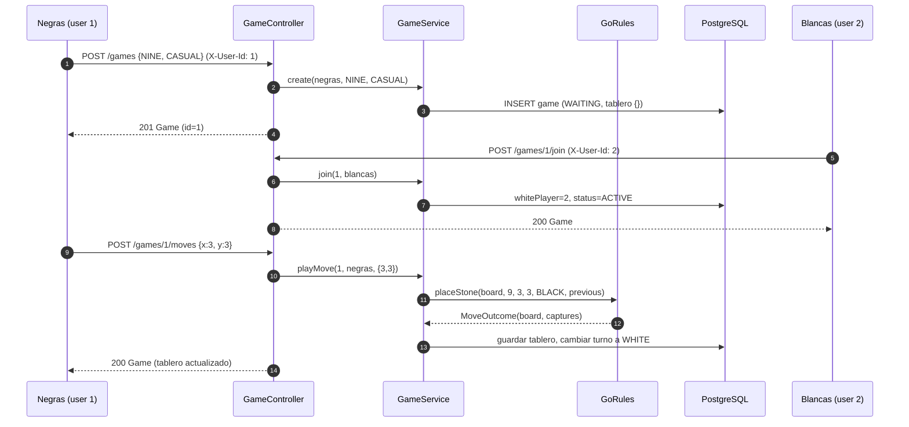
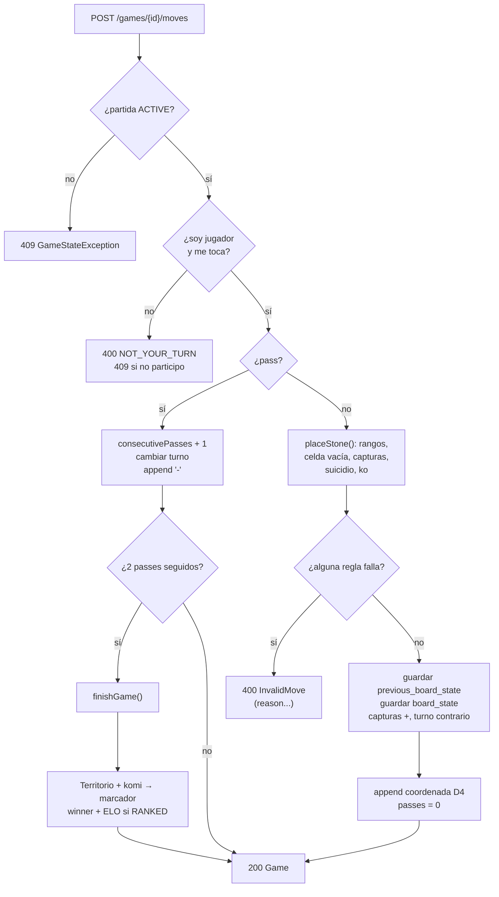
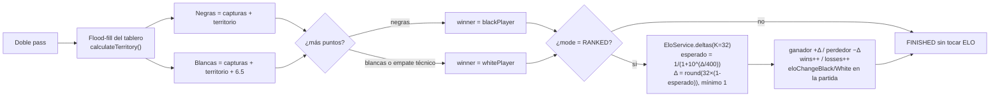
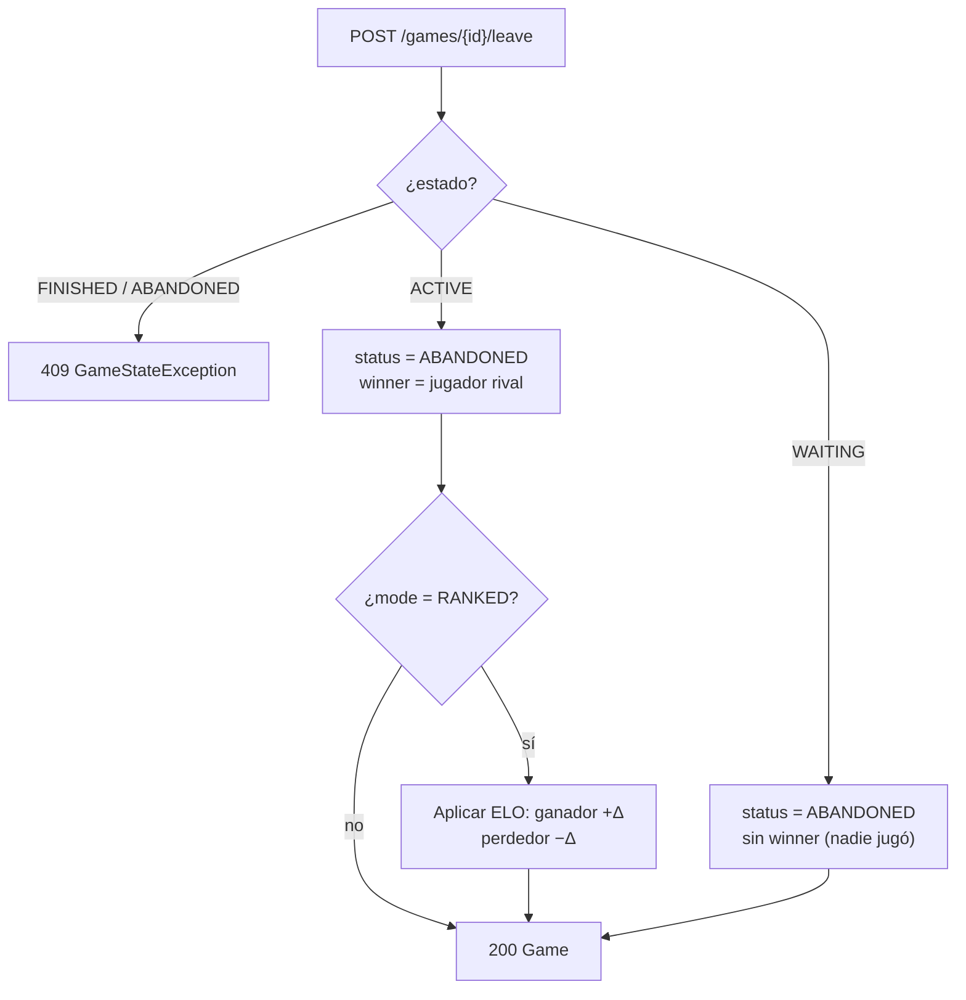
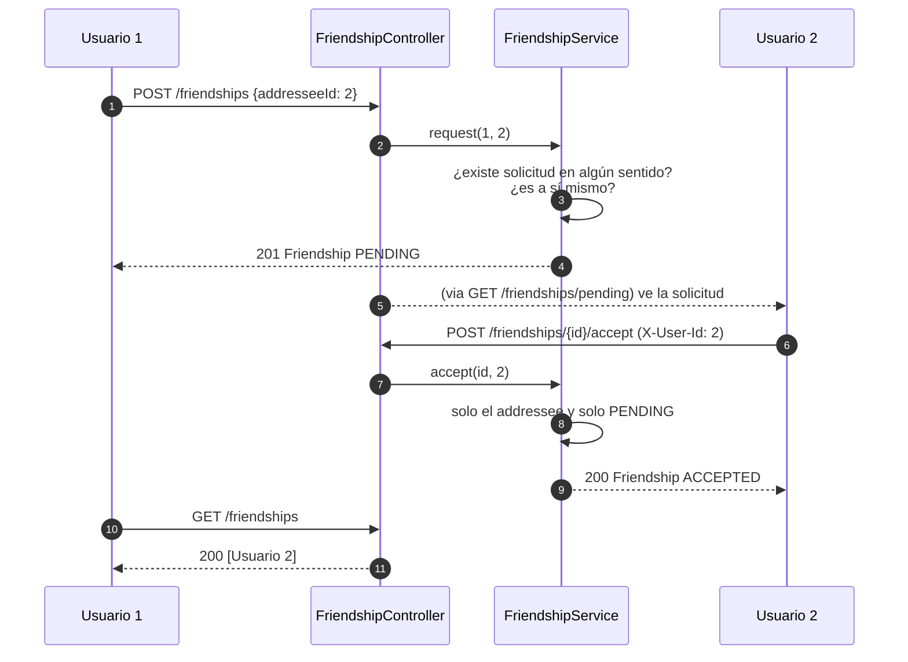
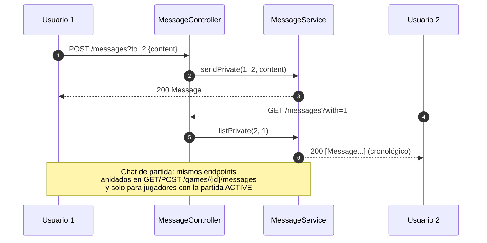

# GoUSC — Guía técnica del backend

Documentación exhaustiva del backend: arquitectura por capas, qué hace **cada archivo**,
API REST completa con ejemplos, reglas del Go y **diagramas de funcionamiento**.

> Otros documentos: [Diseño de la base de datos](database.md) · [README del proyecto](../README.md)

## Índice

1. [Arquitectura por capas](#1-arquitectura-por-capas)
2. [Qué hace cada archivo](#2-qué-hace-cada-archivo)
3. [API REST](#3-api-rest)
4. [Reglas del Go implementadas](#4-reglas-del-go-implementadas)
5. [Diagramas de funcionamiento](#5-diagramas-de-funcionamiento)
6. [Decisiones técnicas](#6-decisiones-técnicas)
7. [Qué queda por hacer](#7-qué-queda-por-hacer)

---

## 1. Arquitectura por capas

Estilo del ejemplo de clase `rest-example`: sencillo y sin librerías de más (sin
seguridad ni atajos de código). Cuatro capas estrictas:



Reglas de la arquitectura:

- **controller** solo traduce HTTP ↔ servicios: recoge la cabecera `X-User-Id`, el *body*
  JSON (DTOs) y los parámetros de ruta; devuelve `ResponseEntity`. No toca la BD.
- **service** contiene toda la lógica (turnos, reglas del Go, ELO, amistades) y lanza
  excepciones de dominio `checked`. Las transacciones (`@Transactional`) están aquí.
- **repository** son interfaces `JpaRepository` con consultas derivadas o `@Query`.
- **model/entity** son las tablas; **model/dto** son los *records* que entran y salen
  por la API (nunca se expone la entidad JPA directamente).
- Cualquier excepción de dominio que suba desde el controller la recoge
  `ErrorController` y la convierte en `application/problem+json` con el código HTTP
  adecuado (ver [§3.4](#34-errores)).

---

## 2. Qué hace cada archivo

Ruta base: `src/main/java/com/usc/boardgames/gousc/`

### 2.1 Raíz y configuración

| Archivo | Qué hace |
|---------|----------|
| `GoUscApplication.java` | Clase principal `@SpringBootApplication`; punto de arranque. |
| `../../resources/application.properties` | DataSource PostgreSQL (`localhost:5432/gousc`), `spring.jpa.generate-ddl=true` (JPA crea el esquema al arrancar), `spring.sql.init.*` (siembra `sql/*.sql` tras crear el esquema), Jackson con indentación y *default view inclusion* activos. |
| `../../resources/sql/users.sql` | Semilla **idempotente** de 4 usuarios (`INSERT ... ON CONFLICT (username) DO NOTHING`): deivi, ana, joel, pepe (contraseñas en texto plano, ELO 1500). |

### 2.2 `model/entity` — tablas JPA

| Archivo | Qué hace |
|---------|----------|
| `User.java` | Tabla `users`: identidad (`id` + `username` único), `password` (texto plano de momento), `email`, `elo` (1500), `wins`/`losses`, `createdAt`. |
| `Game.java` | Tabla `games`: toda la partida. Campos clave: `boardSize`, `mode`, `status` (WAITING→ACTIVE→FINISHED/ABANDONED), `blackPlayer` (creador) / `whitePlayer` (null hasta que se una), `boardState` y `previousBoardState` (JSON del tablero), `moveHistory` (`"D4,E5,-"`), `currentTurn`, `consecutivePasses`, capturas, `komi` (6.5), `winner`, puntuaciones finales, cambios de ELO, marcas de tiempo. El constructor `Game(size, mode, blackPlayer)` deja el tablero vacío `{}` y turno a negras. |
| `Friendship.java` | Tabla `friendships`: solicitud con `requester`, `addressee` y `status`; restricción única (requester, addressee) para no duplicar. |
| `Message.java` | Tabla `messages`: mensaje con `sender`; o bien `recipient` (chat privado) **o** `game` (chat de partida), nunca ambos; `content` y `createdAt`. |
| `BoardSize.java` | Enum `NINE/THIRTEEN/NINETEEN` con `getSize()` (9/13/19). |
| `GameMode.java` | Enum `CASUAL` (sin ELO) / `RANKED` (sí modifica ELO). |
| `GameStatus.java` | Enum `WAITING` (lobby) → `ACTIVE` (jugándose) → `FINISHED` (doble pass) o `ABANDONED` (abandono). |
| `StoneColor.java` | Enum `BLACK`/`WHITE` con `opposite()`. |
| `FriendshipStatus.java` | Enum `PENDING`/`ACCEPTED`/`REJECTED`. |

Todas las enums se persisten como `STRING` (`@Enumerated(EnumType.STRING)`).

Las cuatro tablas usan **Lombok** para no escribir accesores a mano:

```java
@Getter        // genera todos los getXxx()
@Setter        // genera todos setXxx()
@Accessors(chain = true)  // los setters devuelven this, para poder encadenar
public class Game { ... }
```

### 2.3 `model/dto` — contratos de la API

| Archivo | Qué hace |
|---------|----------|
| `Views.java` | Interfaces `Public` y `Private` para `@JsonView`. |
| `User.java` | Record del usuario. `password` lleva `@JsonView(Private)` → **nunca se envía** al cliente (los endpoints de usuario declaran `@JsonView(Public.class)`). Fábrica `from(entity)`. |
| `Game.java` | Record de la partida completo (jugadores anidados como DTO, tablero serializado). `from(entity)`. |
| `Move.java` | Jugada entrada: `{x, y, pass}`. `isPass()` devuelve `true` si `pass=true`. |
| `Friendship.java` / `Message.java` | Records de la solicitud y del mensaje (el mensaje expone `gameId` en vez de la partida entera). |
| `Credentials.java` | Body del login: `{username, password}`. |
| `NewGame.java` | Body de creación de partida: `{boardSize, mode}`. |
| `NewMessage.java` | Body de mensajes: `{content}`. |
| `FriendshipRequest.java` | Body de solicitud de amistad: `{addresseeId}`. |

### 2.4 `exception` — errores de dominio

Todas son `checked` y llevan el dato que necesita el `ErrorController` para armar la
respuesta (id, identificador, reason…):

| Excepción | Origen | HTTP |
|-----------|--------|------|
| `UserNotFoundException` | usuario inexistente (get, login, cabecera…) | 404 |
| `DuplicateUserException` | username ya registrado | 409 |
| `InvalidCredentialsException` | contraseña incorrecta en login | 401 |
| `GameNotFoundException` | partida inexistente | 404 |
| `GameFullException` | unirse a partida con blancas ya ocupadas | 409 |
| `GameStateException` | operación en estado inválido (no ACTIVE, no participante, partida terminada…) | 409 |
| `InvalidMoveException` | jugada ilegal; `reason ∈ {NOT_YOUR_TURN, OCCUPIED_CELL, SUICIDE, KO, OUT_OF_RANGE}` | 400 |
| `FriendshipNotFoundException` | solicitud inexistente | 404 |
| `DuplicateFriendshipException` | solicitud existente en cualquiera de los dos sentidos | 409 |
| `FriendshipStateException` | responder solicitud ya resuelta o no ser el destinatario | 409 |

Además, `IllegalArgumentException` (p. ej. mandarte una solicitud a ti mismo) → 400.

### 2.5 `repository` — acceso a datos

| Archivo | Consultas |
|---------|-----------|
| `UserRepository.java` | `findByUsername`, `existsByUsername`, `findAllByOrderByEloDesc` (ranking), paginación (`findAll(Pageable)`). |
| `GameRepository.java` | `findByStatusOrderByCreatedAtDesc`, `findByBlackPlayerOrWhitePlayerOrderByCreatedAtDesc` (partidas de un usuario), `findAll` paginado/ordenado. |
| `FriendshipRepository.java` | `findByRequesterAndAddressee` (duplicados), `findByAddresseeAndStatus` (pendientes), `findByRequesterAndStatusOrAddresseeAndStatus` (lista de amigos). |
| `MessageRepository.java` | `findByGameIdOrderByCreatedAtAsc` (chat de partida) y `findPrivateConversation` (`@Query` con dos condiciones OR: a→b y b→a). |

### 2.6 `service` — lógica de negocio

| Archivo | Métodos y responsabilidad |
|---------|---------------------------|
| `GoRules.java` (`@Component`) | **Todas las reglas del Go** sobre un `Map<String,String>` (`"3,4" → "B"/"W"`): `placeStone` (rangos, celda ocupada, capturas, suicidio, ko), `groupAndLiberties` (grupo y libertades por *búsqueda*), `calculateTerritory` (territorio por *flood-fill*), `formatCoordinate`/`parseCoordinate` (columnas A–T sin la I). Devuelve los registros `MoveOutcome(board, captures)` y `Group(stones, liberties)`. Ver [§4](#4-reglas-del-go-implementadas). |
| `EloService.java` (`@Component`) | `deltas(ganador, perdedor)`: ELO clásico con **K = 32**, `round(K × (1 − esperado))`, mínimo 1 punto; la suma es siempre 0. |
| `UserService.java` | `create` (dup → excepción), `login` (valida usuario+contraseña en claro), `get`, `update` (email/contraseña opcionales), `ranking`, `recordResult` (victoria/derrota + ajuste de ELO), `entity` (recuperar entidad para FKs). |
| `GameService.java` | Núcleo del juego, `@Transactional`: `create`, `join` (WAITING→ACTIVE), `leave` (ABANDONED; si había rival en juego, `winner` = rival y ELO si RANKED), `list`/`listAll`/`listByUser`, `get`, **`playMove`** (valida estado/turno, delega los passes, serializa el tablero con Jackson). Privados: `doPass` (2 passes seguidos → `finishGame`), `finishGame` (territorio + komi + ELO), `applyElo`, `colorOf`, serialización JSON↔Map. |
| `FriendshipService.java` | `request` (rechaza duplicadas en ambos sentidos y a uno mismo), `accept`/`reject` (solo el `addressee` y solo si está `PENDING`), `listFriends` (amigos aceptados), `listPending`. |
| `MessageService.java` | `sendPrivate` (privado a otro usuario), `sendGame` (solo jugadores y solo si la partida está ACTIVE), `listPrivate`, `listGame`. |

### 2.7 `controller` — endpoints

| Archivo | Rutas |
|---------|-------|
| `UserController.java` | `/users` (registro, listado paginado, login, ranking, get by id, update). |
| `GameController.java` | `/games` (crear, filtrar, detalle, unirse, abandonar, jugadas, chat de partida). |
| `FriendshipController.java` | `/friendships` (solicitar, aceptar, rechazar, amigos, pendientes). |
| `MessageController.java` | `/messages` (chat privado: enviar y leer). |
| `ErrorController.java` | `@RestControllerAdvice`: todas las excepciones de dominio → `ProblemDetail` (ver [§3.4](#34-errores)). |

### 2.8 `src/test`

| Archivo | Qué cubre |
|---------|-----------|
| `GoUscApplicationTests.java` | `@SpringBootTest contextLoads`: arranca la app completa contra PostgreSQL real (crea esquema y siembra usuarios). |
| `service/GoRulesTest.java` | 9 tests unitarios **sin BD**: colocar piedra, celda ocupada, fuera de rango, captura de grupo, suicidio rechazado, ko rechazado, cálculo de territorio, grupo/libertades, ida y vuelta de coordenadas. |

---

## 3. API REST

- Base: `http://localhost:8080`
- Formato: JSON (`application/json`); errores: `application/problem+json`.
- **Autenticación**: no hay spring-security. El cliente hace `POST /users/login` y a
  partir de ahí envía la cabecera **`X-User-Id: <id>`** en todas las operaciones que
  requieren usuario. Si falta la cabecera → 400.
- Las respuestas de usuario usan `@JsonView(Public)`: el campo `password` **nunca** viaja.

### 3.1 Usuarios

| Método | Ruta | Cabecera | Body | Éxito | Errores |
|--------|------|----------|------|-------|---------|
| POST | `/users` | — | `User` (`username`, `password`, `email?`) | **201** + `Location` | 409 usuario duplicado |
| POST | `/users/login` | — | `{username, password}` | 200 `User` | 404 sin usuario · 401 contraseña mal |
| GET | `/users?page&size&sort` | — | — | 200 página (`sort`: `-elo`, `username`…) | — |
| GET | `/users/ranking` | — | — | 200 `List<User>` por ELO desc | — |
| GET | `/users/{id}` | — | — | 200 `User` | 404 |
| PUT | `/users/{id}` | — | `User` (con `email` y/o `password`) | 200 `User` actualizado | 404 |

```bash
# Registro
curl -i -H 'Content-Type: application/json' \
  -d '{"username":"lola","password":"lola123","email":"lola@usc.gal"}' \
  http://localhost:8080/users

# Login (el id devuelto es el que se manda en X-User-Id)
curl -H 'Content-Type: application/json' \
  -d '{"username":"deivi","password":"deivi123"}' \
  http://localhost:8080/users/login
```

```json
{
  "id": 1,
  "username": "deivi",
  "email": "deivi@usc.gal",
  "elo": 1500,
  "wins": 0,
  "losses": 0,
  "createdAt": "2026-10-06T16:00:00"
}
```

### 3.2 Partidas

| Método | Ruta | Cabecera | Body / parámetros | Éxito | Errores |
|--------|------|----------|-------------------|-------|---------|
| POST | `/games` | `X-User-Id` | `{boardSize:NINE\|THIRTEEN\|NINETEEN, mode:CASUAL\|RANKED}` | **201** + `Location` `Game` (WAITING) | 404 user |
| GET | `/games?status&player` | — | `status` (opcional), `player=id` (opcional) | 200 `List<Game>` | 404 user si `player` no existe |
| GET | `/games/{id}` | — | — | 200 `Game` | 404 |
| POST | `/games/{id}/join` | `X-User-Id` | — | 200 (pasa a **ACTIVE**) | 404 · 409 completa |
| POST | `/games/{id}/leave` | `X-User-Id` | — | 200 (**ABANDONED**) | 404 · 409 terminada |
| POST | `/games/{id}/moves` | `X-User-Id` | `{x:0-18, y:0-18, pass:false}` o `{pass:true}` | 200 `Game` con nuevo tablero | 400 jugada · 409 estado · 404 |
| GET | `/games/{id}/messages` | — | — | 200 `List<Message>` | 404 |
| POST | `/games/{id}/messages` | `X-User-Id` | `{content}` | 200 `Message` | 409 no ACTIVE / no jugador |

Ejemplo de ciclo completo (dos jugadores):

```bash
H1='X-User-Id: 1'; H2='X-User-Id: 2'; CT='Content-Type: application/json'

# 1) crear partida rankeada 9x9 (user 1 = negras)
curl -i -X POST -H "$H1" -H "$CT" -d '{"boardSize":"NINE","mode":"RANKED"}' \
  http://localhost:8080/games
# -> 201, Location: .../games/1

# 2) unirse (user 2 = blancas) -> ACTIVE
curl -X POST -H "$H2" http://localhost:8080/games/1/join

# 3) negras juegan en D4 (x=3, y=3)
curl -X POST -H "$H1" -H "$CT" -d '{"x":3,"y":3,"pass":false}' \
  http://localhost:8080/games/1/moves

# 4) blancas pasan; negras pasan -> doble pass = FINISHED
curl -X POST -H "$H2" -H "$CT" -d '{"pass":true}' http://localhost:8080/games/1/moves
curl -X POST -H "$H1" -H "$CT" -d '{"pass":true}' http://localhost:8080/games/1/moves
```

Fragmento de respuesta al finalizar (territorio vacío → gana blancas por el komi 6.5):

```json
{
  "id": 1,
  "status": "FINISHED",
  "currentTurn": "BLACK",
  "consecutivePasses": 2,
  "capturesBlack": 0,
  "capturesWhite": 0,
  "finalScoreBlack": 0.0,
  "finalScoreWhite": 6.5,
  "winner": {"id": 2, "username": "ana", "...": "..."},
  "eloChangeBlack": -16,
  "eloChangeWhite": 16,
  "moveHistory": "D4,-,-"
}
```

El estado del tablero se serializa así (columnas del JSON = celdas ocupadas):

```json
"boardState": "{\"3,3\":\"B\", \"4,4\":\"W\"}"
```

### 3.3 Amistades y chat

| Método | Ruta | Cabecera | Body / parámetros | Éxito | Errores |
|--------|------|----------|-------------------|-------|---------|
| POST | `/friendships` | `X-User-Id` | `{addresseeId}` | **201** `Friendship` (PENDING) | 404 · 409 duplicada · 400 a uno mismo |
| POST | `/friendships/{id}/accept` | `X-User-Id` | — | 200 (ACCEPTED) | 404 · 409 no eres destinatario o ya resuelta |
| POST | `/friendships/{id}/reject` | `X-User-Id` | — | 200 (REJECTED) | igual que accept |
| GET | `/friendships` | `X-User-Id` | — | 200 `List<User>` (amigos) | 404 user |
| GET | `/friendships/pending` | `X-User-Id` | — | 200 `List<Friendship>` recibidas | 404 user |
| POST | `/messages?to={id}` | `X-User-Id` | `{content}` | 200 `Message` | 404 |
| GET | `/messages?with={id}` | `X-User-Id` | — | 200 `List<Message>` cronológico | 404 |

### 3.4 Errores

`ErrorController` convierte cada excepción en `ProblemDetail`:

```json
{
  "type": "http://localhost:8080/error/game-not-found",
  "title": "Partida no encontrada",
  "detail": "No existe ninguna partida con id 99",
  "status": 404,
  "instance": "/games/99"
}
```

| HTTP | Causas |
|------|--------|
| **400** | Jugada inválida (`InvalidMoveException`, con `detail` indicando el motivo), `X-User-Id` ausente, parámetro no convertible, `IllegalArgumentException` (p. ej. solicitarte amistad a ti mismo). |
| **401** | Login con contraseña incorrecta. |
| **404** | Usuario, partida o solicitud de amistad inexistente. |
| **409** | Username duplicado (+ `Location` del usuario), partida llena, operación en estado inválido, solicitud duplicada/resuelta. |

---

## 4. Reglas del Go implementadas

Implementación portada de la referencia
[figurophobia/go](https://github.com/figurophobia/go) (servidor Python), todo en
`service/GoRules.java`:

| Regla | Cómo se hace | Método |
|-------|--------------|--------|
| **Tablero** | `Map<String,String>` con claves `"x,y"` y valores `"B"`/`"W"`; se serializa a JSON con Jackson para guardarlo en `games.board_state` (texto). | `GameService.toBoard/toJson` |
| **Rango** | `0 ≤ x,y < size` → si no, `OUT_OF_RANGE`. | `placeStone` |
| **Celda ocupada** | clave ya presente → `OCCUPIED_CELL`. | `placeStone` |
| **Grupo y libertades** | búsqueda en profundidad desde una celda: piedras conectadas del mismo color + vecinas vacías (libertades). | `groupAndLiberties` |
| **Capturas** | tras colocar, cada vecino enemigo sin libertades → se quita su grupo entero; se cuentan como capturas. | `placeStone` |
| **Suicidio** | si tras colocar el propio grupo no tiene libertades **y** no capturó nada → `SUICIDE` (si capturó, es jugada legal). | `placeStone` |
| **Ko** | el tablero resultante se compara con `previous_board_state` (posición justo antes de la última jugada): si son iguales, la jugada desharía la captura rival → `KO`. | `placeStone` |
| **Pasar** | `pass:true` incrementa `consecutivePasses` y cambia el turno; cualquier jugada real lo pone a 0. | `GameService.doPass` |
| **Fin** | dos passes seguidos → `finishGame`. | `GameService` |
| **Territorio** | por cada región vacía (*flood-fill*), si solo toca piedras de un color, la región entera es suyo; si toca ambos o ninguna → neutra. | `calculateTerritory` |
| **Puntuación** | negras: `capturas + territorio`; blancas: `capturas + territorio + komi (6.5)`. El komi medio punto desempata. | `GameService.finishGame` |
| **Coordenadas** | columnas A–T **sin la I** (estándar Go) + fila desde 1: `(3,3) → "D4"`, `(18,18) → "T19"`. Se usa en `move_history`. | `formatCoordinate` / `parseCoordinate` |

Formato de `games.move_history`: secuencia separada por comas de coordenadas y `-` para
pases, p. ej. `"D4,E5,-,-"` (el color es implícito: empiezan negras y alternan).

---

## 5. Diagramas de funcionamiento

### 5.1 Recorrido de una petición y manejo de errores



### 5.2 Registro, login e identificación del cliente



### 5.3 Crear partida, unirse y jugada



### 5.4 Flujo de validación de una jugada



### 5.5 Fin de partida y ELO



### 5.6 Abandonar una partida



### 5.7 Amistades



### 5.8 Chat privado y de partida



---

## 6. Decisiones técnicas

| Decisión | Motivo |
|----------|--------|
| `Long id` + `username` único (PK numérica) | Más simple que la PK por username del ejemplo; el username sigue siendo único. |
| Contraseñas en texto plano | Decisión temporal del proyecto; no se instala spring-security-crypto. Solo con JWT/BCrypt en el futuro. |
| Identificación por cabecera `X-User-Id` | Sin spring-security: el frontend manda el id tras el login. Fácil de sustituir por JWT después. |
| Tablero como JSON en columnas `text` | Evita decenas de columnas `x0y0...`; el tablero se carga entero y se valida en memoria. |
| `previous_board_state` separado | Permite la regla **ko** comparando el resultado con la posición previa. |
| `move_history` como texto compacto | Historial legible (`"D4,E5,-"`) sin tabla extra. |
| Sin `@Version` | Alineado con la simplicidad del ejemplo (decisión explícita). |
| `spring.jpa.generate-ddl=true` | JPA genera el esquema al arrancar (como en el ejemplo); el SQL no es fuente de verdad. |
| Semillas con `ON CONFLICT DO NOTHING` | El script corre en cada arranque; así no duplica usuarios. |
| Enums como `STRING` | Valores legibles en la BD y en la API. |
| ELO K=32, solo RANKED, suma 0, mínimo 1 | Fórmula estándar; impide partidas amistosas inflando el ranking. |
| Servicios `@Transactional` | Cada operación de negocio es una transacción atómica (partida + ELO juntos). |
| Errores `checked` + `ProblemDetail` | Patrón del ejemplo: el detalle del error incluye el id/dato que falló. |
| Lombok en las entities | `@Getter @Setter` + `@Accessors(chain = true)` ahorran ~400 líneas de accesores. Con JDK 27 hace falta Lombok **1.18.48** (el 1.18.46 que trae Spring Boot 4.1.1 no compila). |

---

## 7. Qué queda por hacer

1. **Fase 3 — Probar y pulir el backend**:
   - Tests automáticos de los endpoints: registro, login, crear partida, unirse, jugar,
     abandonar, amistades y chat. Ahora mismo solo están testeadas las reglas del Go
     (`GoRulesTest`).
   - Validar los datos que llegan del cliente: campos obligatorios, textos no vacíos,
     límites de valores.
   - Corregir lo que salga de esas pruebas.
2. **Fase 4 — Frontend HTML + JavaScript vanilla**: login/registro, lobby de partidas
   (crear, listar WAITING, unirse), tablero de Go (render de `boardState`, envío de
   jugadas y passes), ranking, amigos + chat. Todo consumiendo esta API con la cabecera
   `X-User-Id`.
3. **Fase 5 — Testear el leaderboard**: tests automáticos del ranking y del ELO:
   simular varias partidas rankeadas y comprobar que la clasificación se ordena bien,
   que los cambios de ELO son los esperados y que victorias/derrotas se acumulan.
4. **Fase 6 — Despliegue**: publicar el backend con Docker para que el frontend se
   conecte desde cualquier máquina (y no solo desde este ordenador).
5. **Opcionales**: autenticación real (JWT), partidas y chat en tiempo real (SSE),
   espectadores.

Volver al [README](../README.md) · ver el [modelo de datos](database.md).
