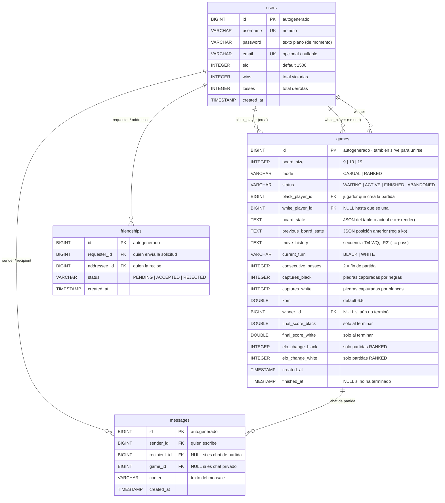

# GoUSC — Diseño de la base de datos

Esquema de PostgreSQL (`gousc`) definido por las entidades JPA. Diagrama también disponible como
imagen: [database.png](database.png).

> Guía técnica completa (capas, cada archivo, endpoints y diagramas de funcionamiento):
> [backend.md](backend.md) · [README del proyecto](../README.md)

## Explicaciones

- **`board_state` / `previous_board_state`**: JSON del tablero serializado en TEXT; la columna
  *previous* es la que compara la regla del ko.
- **`move_history`**: historial completo en un solo string con los movimientos en secuencia
  (`D4,WQ,-,R3`: columna `A`–`T` sin `I` + fila, `-` = pass), el color es implícito porque
  siempre empiezan negras y alternan.
- **`captures_black/white`**: no se pueden derivar del tablero porque las piedras capturadas ya
  no están en él.
- **`winner_id` + `final_score_*`**: el ganador es imprescindible en forfeits (sin puntuación) y
  las puntuaciones guardan el resultado final (territorio + capturas + komi).
- **`elo_change_black/white`**: dependen del elo que tenían ambos jugadores antes de la partida.
- **`current_turn` / `consecutive_passes`**: se validan en cada jugada, así que se guardan como
  campos de la partida.
- **Jugadores**: el creador juega negras (`black_player_id` al crear) y `white_player_id` queda
  NULL hasta que alguien se une (`status=WAITING`); se usa el `id` de la partida para unirse.
- **Enums como VARCHAR**: `mode`, `status`, `current_turn`.
- **`email`**: opcional de momento, se usará con la fase de autenticación.
- **`komi`**: configurable por partida con default 6.5 (por eso no hay empates).

## Funcionalidades opcionales

- **`friendships`**: una sola tabla para solicitudes (`PENDING`) y lista de amigos
  (`ACCEPTED`); el estado de conexión online/offline no necesita tabla porque es efímero.
- **`messages`**: chat privado y de partida en la misma tabla (`game_id` o `recipient_id`, nunca
  ambos).
- **Espectadores**: sin tablas, se sirve con `GET /api/games/{id}`.

Las dos tablas opcionales son puramente aditivas: si quedan fuera del alcance se eliminan sin
tocar el resto del esquema.

---

Volver a la [guía técnica del backend](backend.md) · [README](../README.md).
